```{r setup, include=FALSE}
options(htmltools.dir.version = FALSE)
```

class: center, middle

# Many Labs 2

---


# Cause for Concern

--

.center[]
--


.center[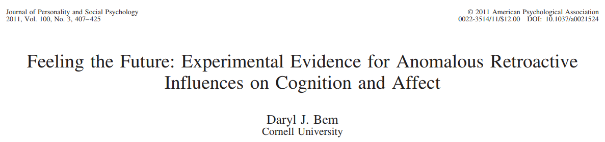]
--


.center[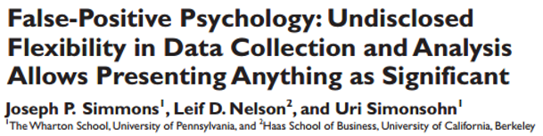]

---

# Flexibility in Data Analysis

.center[http://fivethirtyeight.com/features/science-isnt-broken
]

.center[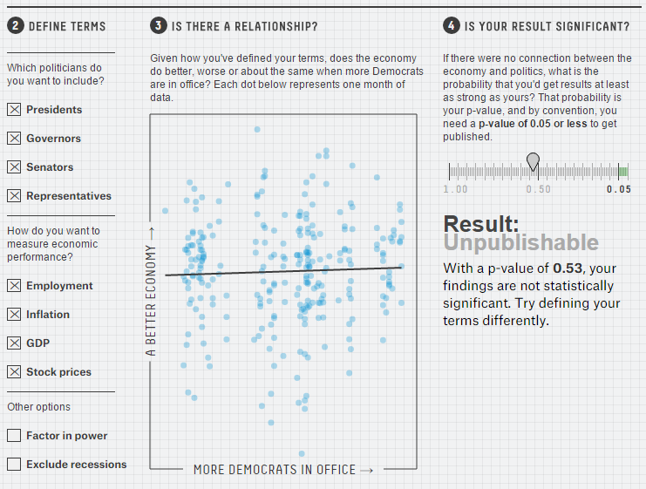]

---

# Flexibility in Data Analysis

.center[http://fivethirtyeight.com/features/science-isnt-broken
]

.center[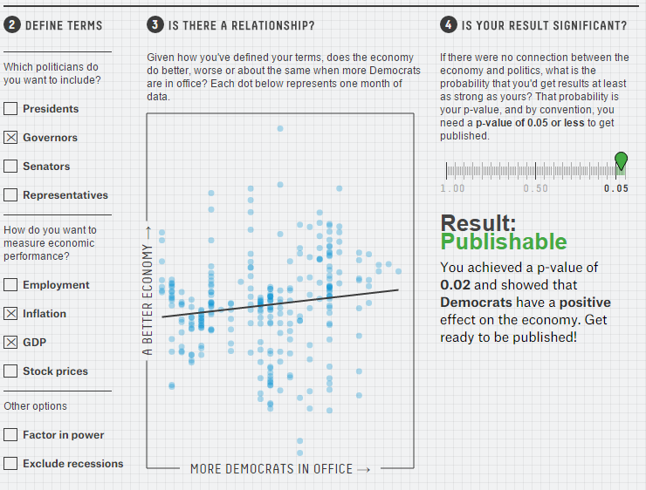]

---

# Flexibility in Data Analysis

.center[http://fivethirtyeight.com/features/science-isnt-broken
]

.center[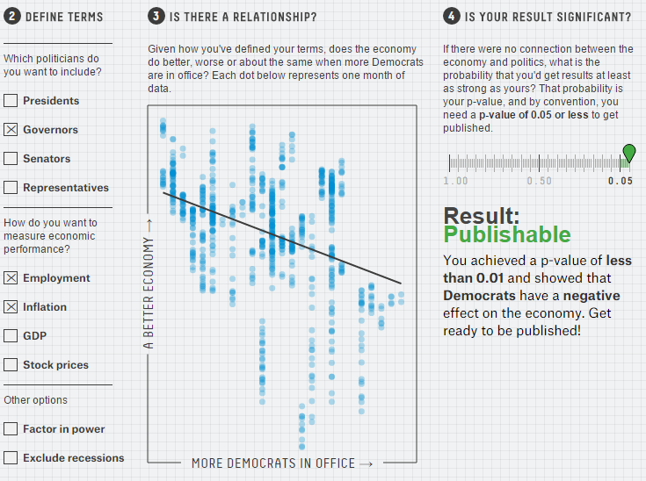]

---

# Failures to Replicate

--

- `Reproducibility Project: Psychology` <small>(OSC, 2015)</small>  
  - ~40/100 studies replicated
--

- `Social Sciences Replication Project` <small>(Camerer et al., 2018)</small>
  - 13/21 replicated
  - All from Science and Nature
--

- `Multiple large-scale Registered Reports` 
  - POPS/AMPPS Registered Replication Reports

---

# Failures to Replicate

--

- What we know: Many studies are failing to replicate
--

- Why? Not sure
--

  - Could be false positives
--

  - Could be many other reasons: 
  - Moderators (known/unknown)
  - Lack of care/expertise
  - Sensitivity of effects to sample/context

---


# Many Labs Projects

--

Each ML project examines a different aspect of replication. Each question requires data colletion at multiple labs.  
- `Many Labs 1` <small>(Klein et al., 2014)</small>  
  - 10/13 successful replications
  - Little variation between samples
--

- `Many Labs 2` <small>(Klein et al., in press)</small>
  - Discussing today
--

- `Many Labs 3` <small>(Ebersole et al., 2016)</small>
  - 3/10 successful replications
  - Little variation across semester
--

- `Many Labs 4` <small>(Klein et al., in prep)</small>
  - Terror Management Theory-specific
  - Compare expert replications vs "in-house" replications
--

- `Many Labs 5` <small>(Ebersole et al., in prep)</small>
  - Follow-up to Reproducibility Project
  
---

# Many Labs 2

--

Like Many Labs 1, but a much stronger test:
--

- Goal: Replicate many different studies all around the world and compare if they vary based on the sample of data collection.
--

- Replicated 28 studies
  - Split across two study "packages" due to length
  - Computerized in Qualtrics
  - Randomized study order, presented back-to-back
--
  
- Which studies?
  - Structured selection process by committee. Documented: osf.io/8cd4r
  - Sought open nominations for studies
  - Emphasized impact (citations, etc.), diversity of content, possibility for variability across sites
  - But substantial practical constraints: Short, able to be computerized
  - Authors could decline to be replicated

---

# Many Labs 2

--
- Registered Replication Report at AMPPS:
  - Each study reviewed and approved by original authors or other experts
  - Analysis plan(s) specified in advance (osf.io/c97pd/)
  - Open data and materials

--
- Administer packages across 125 samples
  - Slate 1: 13 studies administered in each of 61 labs
  - Slate 2: 15 studies administered in each of 64 labs
  - Sites (mostly) randomly assigned to slates
  - Minimum of 80 participants per site
  - 15,305 participants total
  - Much more diverse

---

# Many Labs 1 Map

.center[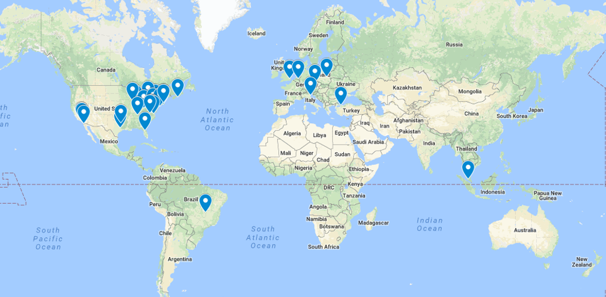]

---

# Many Labs 2 Map

.center[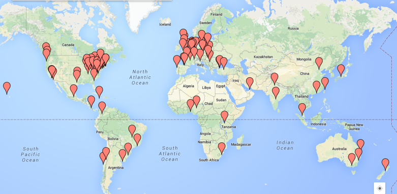]

---

# Many Labs 2 Hsee example

.center[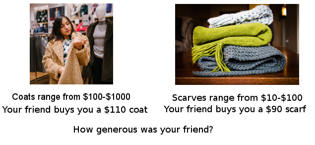]

---

# Many Labs 2 Hsee results

<br>
<br>
<br>

.center[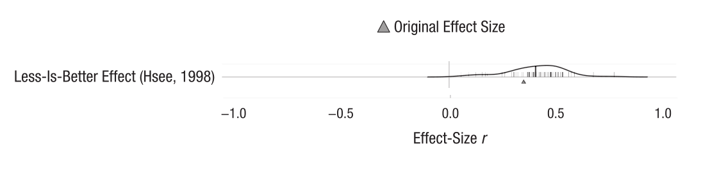]

---

.center[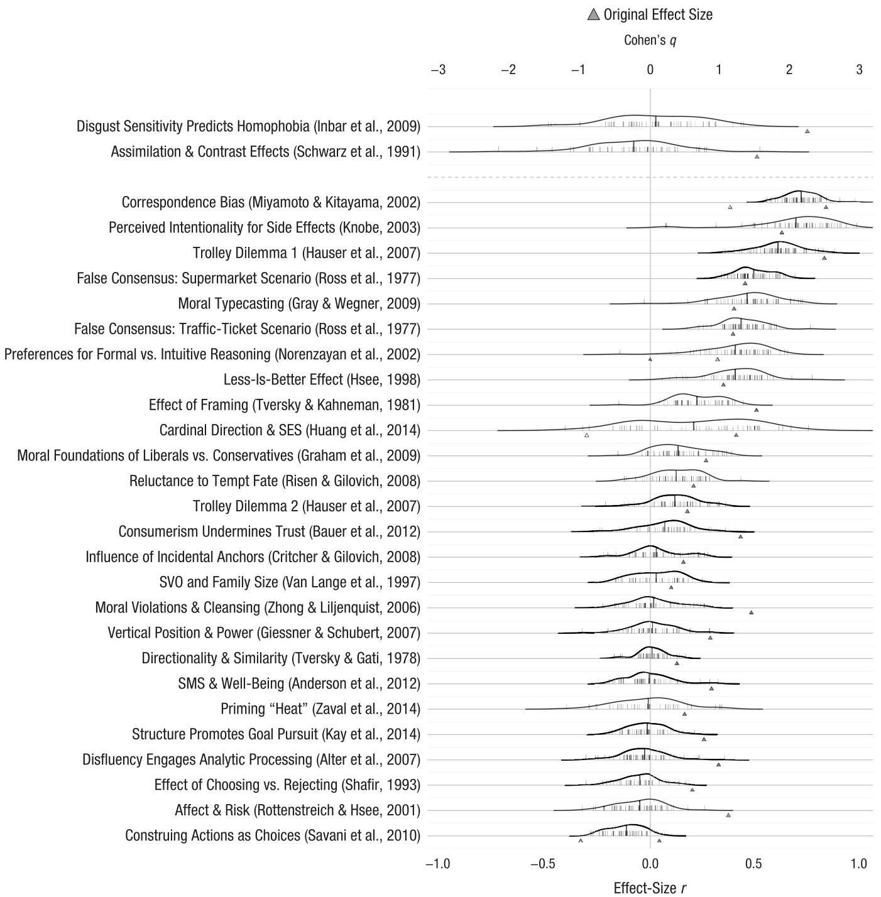]

---

# Many Labs 2 Results

--
- 14/28 successful replications
  - <i>p</i> < .0001, non-trivial effect size, same direction as original
  - One weakly supported, <i>p</i> = .03 but near-zero effect size

--
- 75% has smaller effect size than original
  - Median original <i>d</i> = 0.60
  - Median replication <i>d</i> = 0.15

--
- No evidence that the order of the studies mattered
  - In general, didn't matter if the study came first, last, or in any other position.
  - Same as ML1 and ML3

--

.center[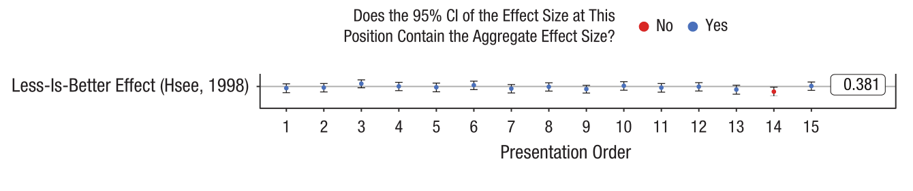]

---

.center[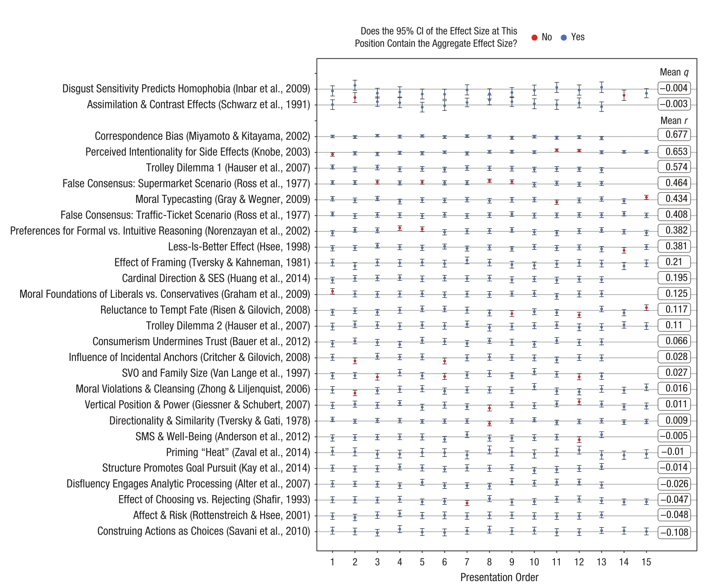]

---

# Many Labs 2 Heterogeneity

--
- Q statistic: (~ significance test for variation across sites exceeding chance)
  - 11/28 (39%) showed significant heterogeneity
  - Nearly all from larger-effects studies

--
- I²:
  - 36% showed at least medium heterogeneity
  - Likely not an appropriate measure in this case:
  - See [osf.io/frbuv](osf.io/frbuv) (Marcel van Assen), [Datacolada.org/63](Datacolada.org/63), Borenstein+Higgins

--
- Tau is probably best
  - SD across samples in the unit of the effect size (after accounting for sampling error)

---

.center[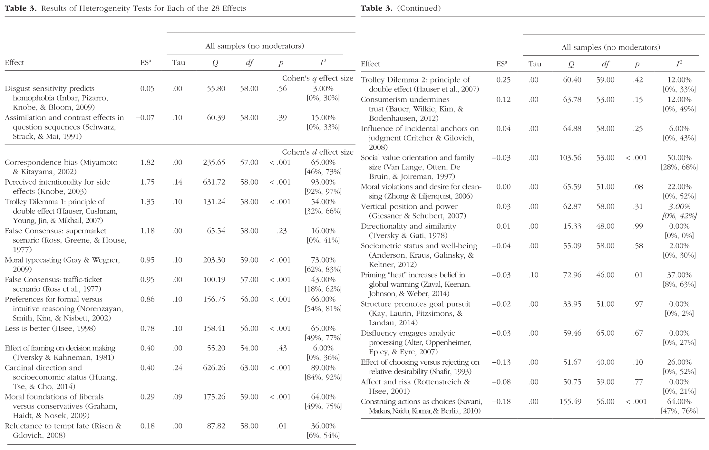]

---


.center[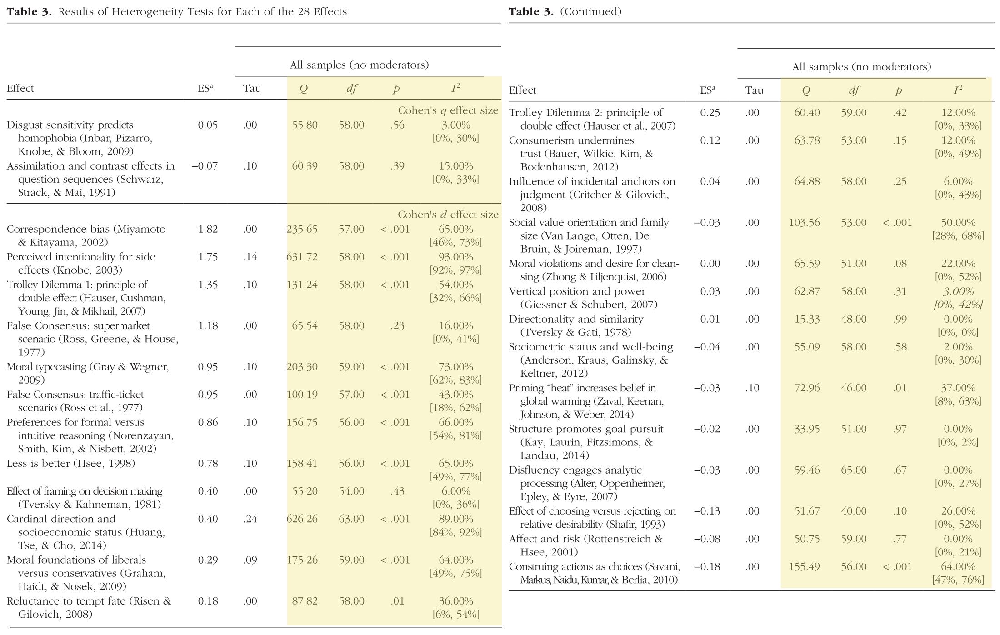]

---


.center[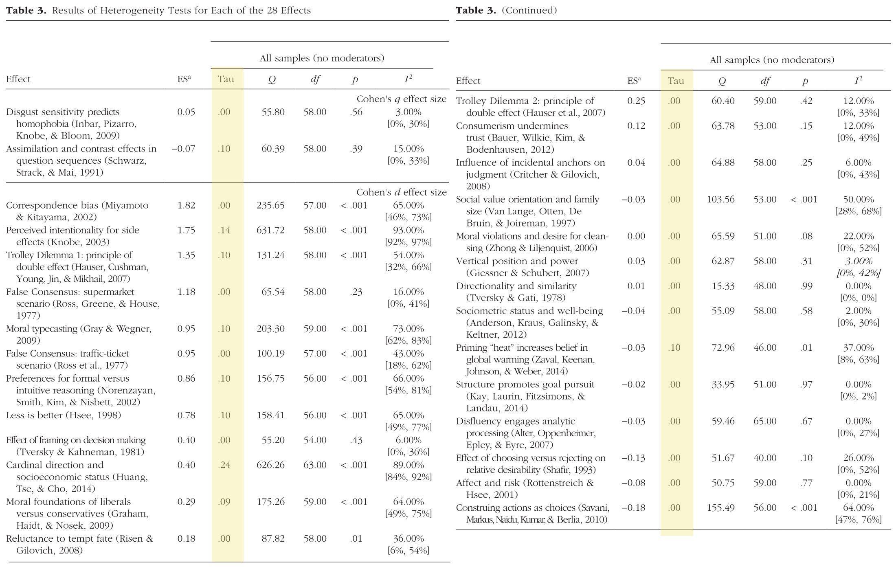]

---

# Discussion

--
- Low variation across sample/context

--
  - Not reasonable to discount replications <i>by default</i> based on sample

--
  - Instead, test moderators empirically

--
- Big caveat: Mostly student samples, mostly short computerized studies

--
- Replication rate aligns with other projects
  - Is this meaningful?

--
- Many studies replicate robustly

--
- Personal takeaways:

--
  - Robust replicability is a feasible goal (for many studies)

--
  - Nudges me towards "false-positive" explanation for replication failures (in general)

--
  - Reinforces need for preregistration/Registered Reports

--
- Open data: [https://osf.io/8cd4r/](https://osf.io/8cd4r/)
  - CC0, free use (any purpose)
  - We barely scratched surface

---

class: center, middle

# Thanks!

Special thanks to co-leads Fred Hasselman, Michelangelo Vianello, and Brian Nosek + 186 other co-authors.
  
Questions/comments?

<br>
<br>
<br>
@raklein3 <br>
raklein22@gmail.com <br>
https://www.raklein.me 

<br>
<br>

&nbsp;&nbsp;&nbsp;&nbsp;&nbsp;&nbsp;